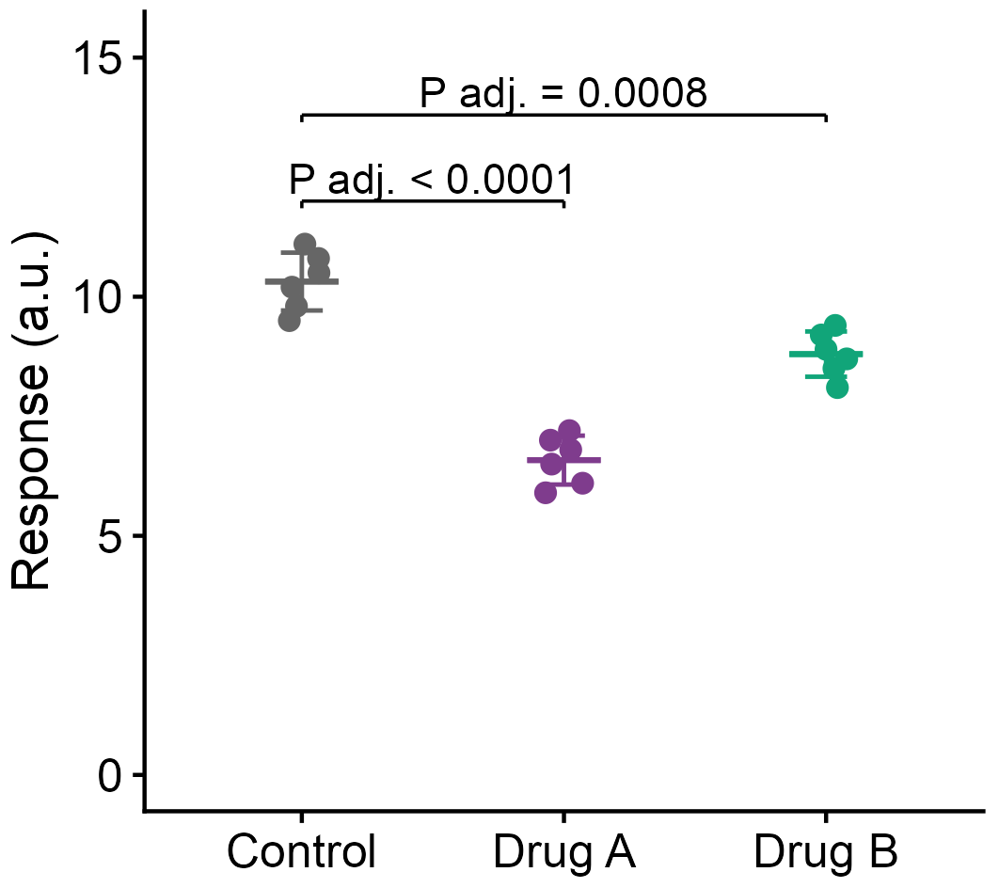
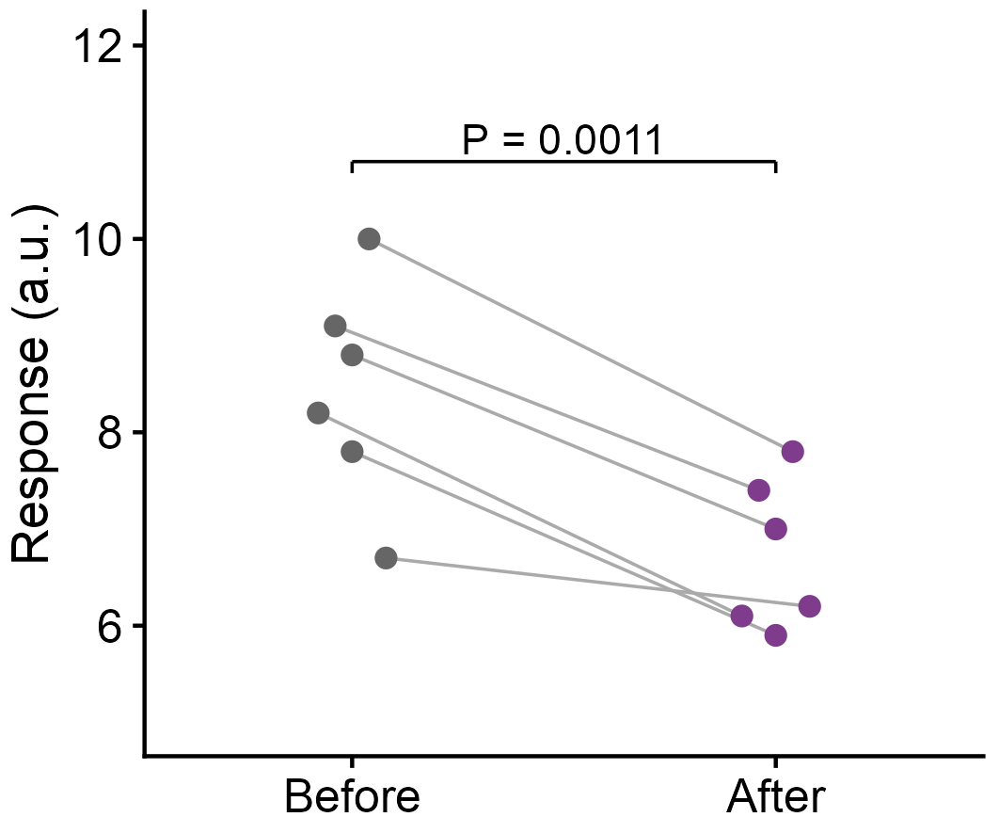
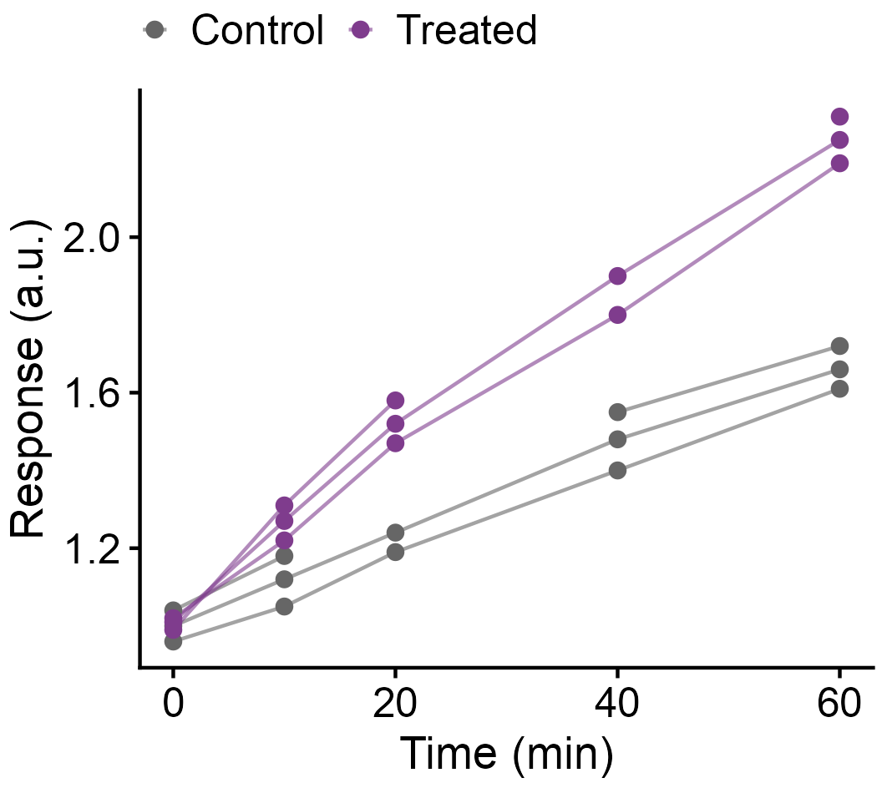
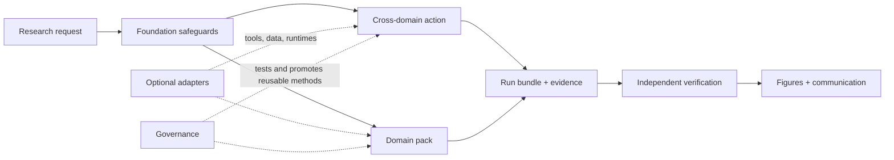

# Biomed Skills

32 portable biomedical research skills. See [what is developed](docs/developed-suite.md)
for the complete inventory and implementation status.

## Start with a figure

Give the agent a biomedical data table and get a PDF/PNG, editable source, direct
plotting data and reported statistics. Optional `.pzfx` files open as editable
Column, Grouped or XY tables in GraphPad Prism.

From this repository, install only the figure skill into Codex:

```bash
python3 tools/install_skills.py \
  --target "${CODEX_HOME:-$HOME/.codex}/skills" \
  --skill create-scientific-figures
```

Start a new task and ask:

> Use $create-scientific-figures on my CSV. Make a compact figure with individual
> observations and appropriate statistics. Save PDF/PNG, editable source and
> an editable GraphPad Prism file.

The [figure quickstart](skills/create-scientific-figures/references/quickstart.md)
lists runtime/font checks, portable examples and rendered color previews. The
[visual gallery](skills/create-scientific-figures/references/visual-gallery.md)
adds six analysis cases and a four-panel composition. R, Python and GraphPad
Prism are separate execution choices; installing the skill does not install those
applications or their dependencies.

| Independent groups | Paired observations | Repeated trajectories |
|---|---|---|
|  |  |  |

These examples use explicitly synthetic teaching data. Each ships with its CSV,
rerunnable R code and editable Prism table.

## The full suite

Thirty-two portable, composable skills for reproducible biomedical research across
agent harnesses. The suite now supports general biomedical work, clinical
time-to-event analysis, medical-imaging model evaluation, dose-response experiments,
and a complete single-cell pack without copying shared policy into every workflow.

The figure skill covers biomedical research, including basic biology, experimental,
omics, imaging, clinical and translational studies.

The suite supports scientists rather than replacing scientific judgment. It
automates routine execution and audit work, preserves evidence and limitations, and
keeps consequential choices visible to the researcher.

## Architecture



The five logical layers are:

| Layer | Responsibility |
|---|---|
| Foundation | Modality-neutral planning, study design, provenance, data validation, verification, orchestration, figures, and communication |
| Cross-domain action | Reusable scientific actions such as evidence synthesis, model evaluation, and pathway enrichment |
| Domain pack | Domain-specific routing, QC, inference, and interpretation for single-cell, clinical, imaging, spatial, or experimental work |
| Adapter | Optional tools, APIs, formats, runtimes, and compute capabilities with explicit fallbacks |
| Governance | Controlled method distillation, testing, promotion, versioning, and retirement |

Skills remain flat under `skills/<skill-name>/`; logical composition lives in
[`suite.json`](suite.json). Its bundles install coherent subsets without duplicating
packages: `core`, `general`, `single-cell`, `spatial`, `clinical`, `imaging`,
`experimental`, and `governance`.

## Suite contents

| Group | Count | Contents |
|---|---:|---|
| Foundation and reusable actions | 12 | Shared safeguards, evidence synthesis, paper evidence maps, general model evaluation, and pathway enrichment |
| Single-cell domain pack | 15 | Data discovery through preprocessing, inference, spatial/Perturb-seq analysis, and target prioritization |
| Reference vertical slices | 3 | Clinical time-to-event, medical-imaging model evaluation, and experimental dose response |
| Governance | 2 | Suite maintenance and biomedical-method distillation |
| **Total** | **32** | Canonical packages registered in `suite.json` |

The seven additions that broaden the original omics-oriented suite are
`design-biomedical-study`, `validate-biomedical-data`,
`synthesize-biomedical-evidence`, `evaluate-biomedical-models`,
`model-time-to-event-outcomes`, `evaluate-medical-imaging-models`, and
`analyze-dose-response`. Paper-method mining is now the modality-neutral
`distill-biomedical-methods`; its former names remain discoverable through registry
aliases and the [migration map](docs/migration-map.md).

See the [developed-skills inventory](docs/developed-suite.md),
[architecture](docs/architecture.md), and [installation guide](docs/install.md).

For a single paper, [paper-evidence-map](skills/paper-evidence-map/SKILL.md) links
its claims to experiments, controls and observed results, with figure references.
It produces an editable Obsidian Canvas, a visual preview and linked evidence
tables. Install it with `--skill paper-evidence-map`, then ask:

> Use $paper-evidence-map on this PDF. Extract the paper's logic, subclaims,
> experiments and supporting results into an editable evidence map.

## Versioned analysis artifacts

Analyses use one compact, platform-neutral run bundle:

```text
.ai-scientist/current/
├── analysis-contract.json
├── run-manifest.json
├── evidence-index.json
├── verification-report.json
└── handoffs/<task_id>.json      # only when work crosses agents/contexts
```

Artifact schema version 1.1 adds nested analysis units, outcomes and analysis sets,
research-governance flags, physical and computational resources, generic evidence
denominators, verifier-independence assertions, and strict rerun records. Each
artifact also has an `extensions` object. Named resource profiles connect a domain
extension schema and verification catalog without weakening the common kernel. The
current profiles cover single-cell analysis, clinical time-to-event analysis,
medical-imaging model evaluation, and dose response.

Superseded bundles may be moved to `.ai-scientist/archive/`; only the current bundle
remains active.

Run the dependency-free repository check with:

```bash
python tools/check_suite.py
```

