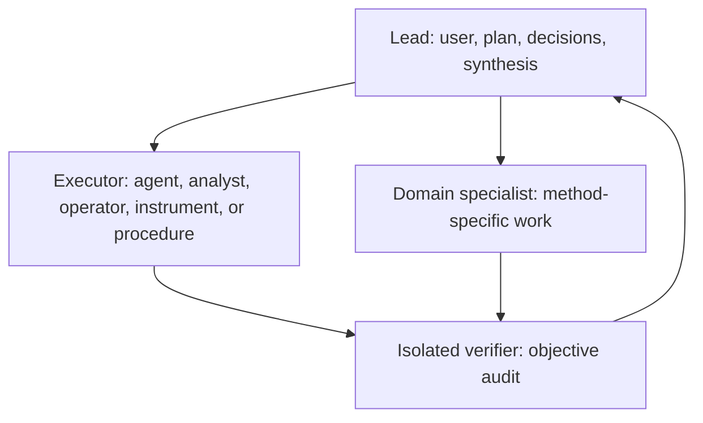

# Suite architecture

## Five logical layers

The suite separates scientific responsibility from packaging. All 32 canonical
skills are flat directories under `skills/`; the registry composes them into layers
and install bundles.

| Layer | Owns | Current examples |
|---|---|---|
| Foundation | Shared contracts and safeguards that should behave consistently in every domain | `plan-biomedical-analysis`, `design-biomedical-study`, `ensure-biomedical-reproducibility`, `validate-biomedical-data`, `verify-biomedical-analysis`, `orchestrate-biomedical-work`, `create-scientific-figures`, `communicate-biomedical-results` |
| Cross-domain action | A coherent scientific action reusable by more than one domain | `synthesize-biomedical-evidence`, `paper-evidence-map`, `evaluate-biomedical-models`, `analyze-pathway-enrichment` |
| Domain pack | Domain routing, conventions, methods, QC, and bounded interpretation | The 15-skill single-cell pack plus clinical time-to-event, imaging-model evaluation, and dose-response vertical slices |
| Adapter | Optional execution support for tools, APIs, data formats, runtimes, and compute | Registry `optional_capabilities` and external tool-specific skills; adapters do not own scientific policy |
| Governance | The lifecycle of reusable suite knowledge | `maintain-biomedical-skills`, `distill-biomedical-methods` |

An install bundle is not a new copy of a skill. For example, the `clinical` bundle
includes `core` and selects shared study-design, validation, evidence, model,
time-to-event, and dose-response skills. The `spatial` bundle selects only the shared
core, data validation, and spatial skill rather than every single-cell leaf.

## Boundary rule

Put a rule in exactly one owner skill:

- Planning owns the question, design, success criteria, constraints, operating
  profile, and unresolved decisions.
- Study design owns estimands, units, sampling, allocation, bias controls, and
  analysis-set definitions before execution.
- Reproducibility owns provenance and lineage, never figure aesthetics or method
  selection.
- Data validation owns structural integrity and analysis readiness, not scientific
  interpretation.
- Cross-domain and domain skills own method choice, domain QC, parameters, outputs,
  and domain caveats, never generic provenance or orchestration.
- Verification owns independent checks and reports; it does not silently repair the
  executor's work.
- Figure creation owns visual encoding, accessibility, export, source data, and
  render-then-inspect QA.
- Communication owns claim framing, audience adaptation, negative results, and the
  main-versus-supplement story.
- Adapters translate capabilities and formats but do not redefine scientific rules.
- Governance owns the suite lifecycle, not project run state.

## Registry version 2

[`suite.json`](../suite.json) is the machine-readable composition layer. Version 2
separates meanings that were previously overloaded:

| Field | Meaning |
|---|---|
| `kind` | Operational shape: `foundation`, `router`, `leaf`, or `governance` |
| `scopes` | Scientific applicability such as `any`, `clinical`, `imaging`, `omics`, or `single-cell` |
| `stage` | Typical workflow stage; descriptive rather than an execution dependency |
| `requires` | Hard skill dependencies needed for the declared behavior |
| `recommends` | Useful optional composition that may be omitted with a documented fallback |
| `routes_to` | Destinations a router may select from |
| `optional_capabilities` | Tools, runtimes, connectors, or compute that improve execution but are not portable scientific policy |
| `legacy_names` | Searchable aliases used for migration; duplicate compatibility skills are not installed |
| `resource_profiles` | Domain extension and verification profiles activated by the skill |

Top-level `bundles` provide dependency-aware installation sets. `core`, `general`,
`single-cell`, `spatial`, `clinical`, `imaging`, `experimental`, and `governance`
are registry views over the same flat packages.

The five logical layers and registry `kind` are deliberately different concepts. A
foundation-layer responsibility such as communication can be a `leaf`, and a domain
entry point such as `analyze-single-cell` can be a `router`.

## Operating profiles

| Profile | Agent freedom | Required safeguards | Typical use |
|---|---|---|---|
| Exploratory | High within documented best practice | Contract, input QC, key decisions, basic manifest, exploratory labels | Discovery and orientation |
| Confirmatory | Moderate; prespecified choices take precedence | Locked contrasts or estimands, assumption checks, multiplicity policy, deviations log, evidence index, independent verification | Planned analyses and manuscript claims |
| Strict | Low at fragile steps | Deterministic manifest, checksums, frozen references, lockfile or container, cached APIs, versioned pipeline, isolated verifier, rerun check | High-risk or archival work |

The profile is chosen from scientific risk, reversibility, novelty, and the user's
reproducibility requirement. It is not chosen from a vendor or model name.

## Shared run bundle, version 1.1

### `analysis-contract.json`

The executable specification: objective, answerable questions, inputs, nested units,
outcomes, analysis sets, factors and contrasts where relevant, methods, required
outputs, validation, audiences, constraints, profile, assumptions, and decisions.
Version 1.1 adds a compact research-governance screen for human subjects, animals,
sensitive data, hazardous materials, approvals, and restrictions. Individual risk
types may be marked not applicable, but the screen itself is explicit.

### `run-manifest.json`

The provenance record: files and hashes, databases and API snapshots, code and
commands, packages and runtimes, parameters and rationale, QC, assumptions,
intermediate artifacts, and outputs. Version 1.1 can also identify protocols,
instruments, reagents and lots, calibration records, models, and reference standards;
steps link explicitly to input, upstream artifact, resource, and output identifiers.

### `evidence-index.json`

A claim-to-evidence map. Evidence can point to a contrast, outcome, analysis set,
unit type, and hashed or materialized unit set. Statistics record their count basis
and denominator, so patients, lesions, readers, events, experiments, person-time,
samples, or cells are not conflated.

### `verification-report.json`

Machine-first checks with method, severity, evidence, and remediation. Version 1.1
records the verifier type, whether independence from the executor was asserted, and
strict rerun status and numerical tolerance where required.

### `handoffs/<task_id>.json`

Created only when work crosses an agent or context boundary. It contains the task,
decisions, artifact paths, open questions, and next action—not a duplicate project
diary.

Every core artifact has a top-level `extensions` object. Core validators retain
common structure while named resource profiles add a domain-specific contract schema
and verification catalog. Four profiles are registered:

| Profile | Contract focus | Verification focus |
|---|---|---|
| `single-cell-analysis` | Sample/cell structure and planned single-cell workflow | Cell QC, integration, annotation, replicate-aware inference, identifiability |
| `clinical-time-to-event` | Population, time zero, event, censoring, competing events, estimand | Cohort construction, event process, model diagnostics, sensitivity and claims |
| `medical-imaging-model-evaluation` | Intended use, modality, clinical/split unit, reference standard | Image integrity, leakage, reference standard, task metrics and claims |
| `dose-response` | Independent unit, dose range/units, controls, response, estimand | Assay controls, curve support, model diagnostics, comparisons and claims |

New runs should emit artifact schema version 1.1. Archived version 1.0 bundles remain
historical records rather than being rewritten in place.

## Role model

A single capable agent may fill all roles for routine computational work, but it must
perform the verification pass from raw artifacts rather than treating its earlier
conclusion as ground truth. Human analysts, clinicians, laboratory operators,
instrument workflows, and controlled procedures can also execute tasks when their
authority, training, approvals, inputs, outputs, and acceptance checks are recorded.
Separate actors are preferred when stakes, context length, or method complexity
justify the coordination cost.

Use ensembles only for bounded independent judgments such as classification, ranked
prioritization, relevance, or tool choice. Do not majority-vote open-ended hypotheses,
literature reviews, or dependent multistep pipelines.

## Memory and growth

Keep three layers distinct:

1. Ephemeral execution state: console output, scratch calculations, temporary files.
2. Project memory: the current run bundle and concise project decisions.
3. Suite knowledge: only patterns shown to generalize through repeated successful
   use, a meaningful benchmark, or strong method-and-code evidence.

`distill-biomedical-methods` extracts provenance-rich methods from papers,
supplements, protocols, registrations, data records, and code. It stages proposals;
`maintain-biomedical-skills` owns overlap checks, forward tests, approval, promotion,
versioning, and retirement. Literature synthesis that answers a research question
belongs to `synthesize-biomedical-evidence`, not to governance.

## Portability

- Use skill-standard `SKILL.md`, `references/`, `scripts/`, and `assets/` folders.
- Keep core instructions tool-agnostic; platform metadata belongs under `agents/`.
- Select workers by capabilities such as planning, execution reliability, domain
  knowledge, verification discipline, and context capacity.
- Treat connectors, schedulers, and specialized tools as optional adapters with
  explicit fallbacks.
- Keep `SKILL.md` concise and load detailed references only when the task needs them.
